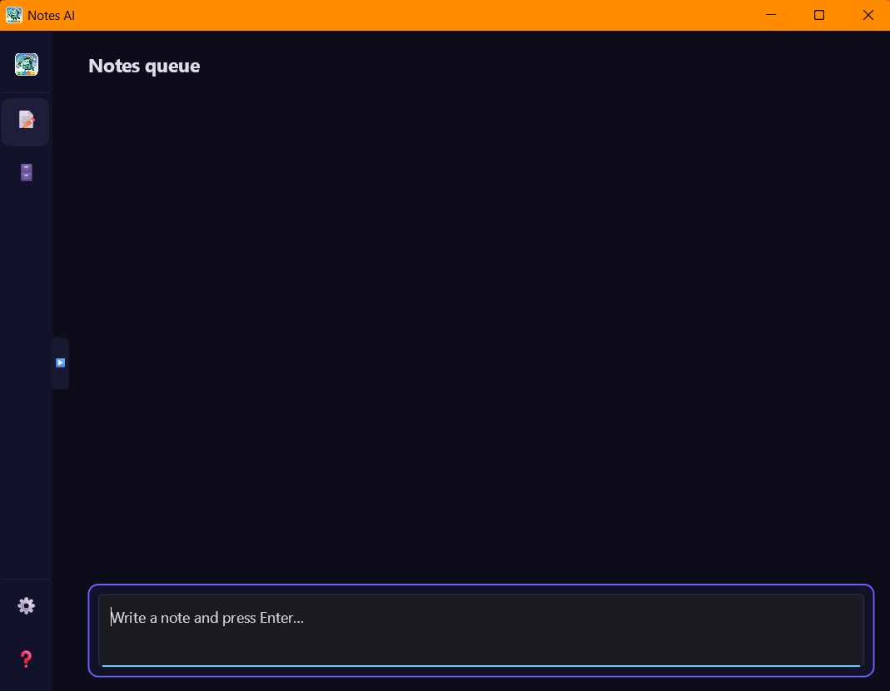
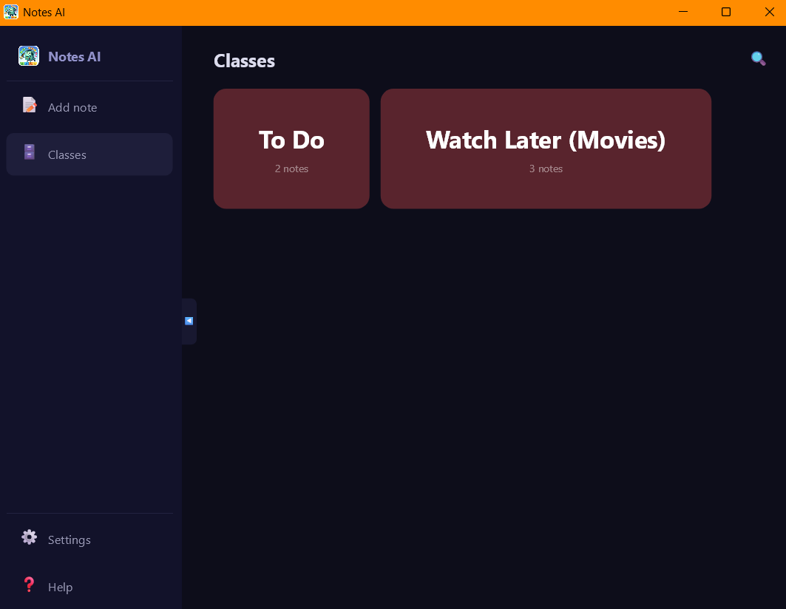
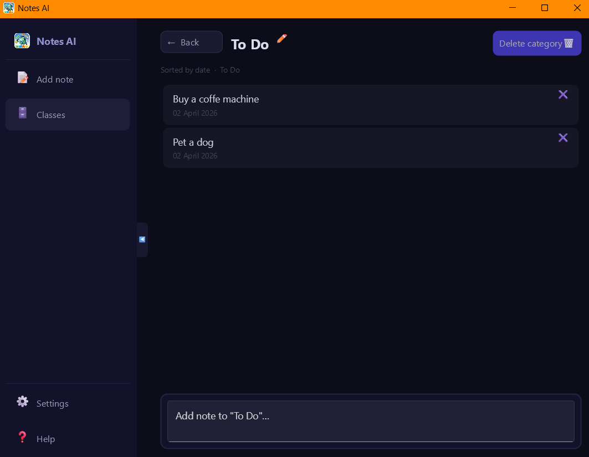

# notes_ai

A minimalist desktop app for taking notes with automatic LLM categorization and semantic search.

Write a note — the LLM figures out the category and files it away. Search by meaning, not exact words: type "movie about space" and find the right note instantly.

---

## Screenshots
Main Page

---
Categories Page

---
Category clicked

---

## Stack

- **UI** — [Slint](https://slint.rs/)
- **LLM / embeddings** — [Ollama](https://ollama.com/) (runs locally)
- **DB** — SQLite + [sqlite-vec](https://github.com/asg017/sqlite-vec) for vector search

## Requirements

Install [Ollama](https://ollama.com/), then pull two models:

```bash
# LLM for note classification
ollama pull qwen3:4b-thinking

# Embeddings model for semantic search
ollama pull nomic-embed-text-v2-moe
```

> Both models can be changed in the app settings.

## Run

```bash
cargo run --release
```

## How it works

1. Write a note in the **Main** tab — it goes into a processing queue
2. The LLM classifies it in the background and moves it to the right category
3. Semantic search finds notes by meaning, not just keyword matches
